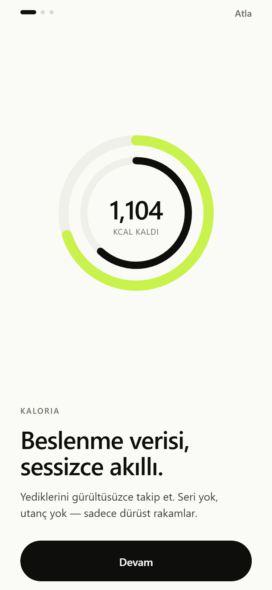
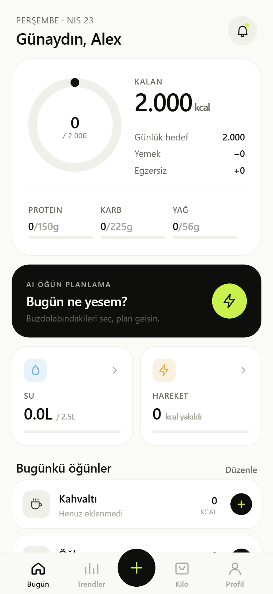
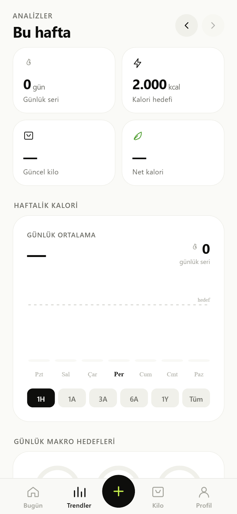
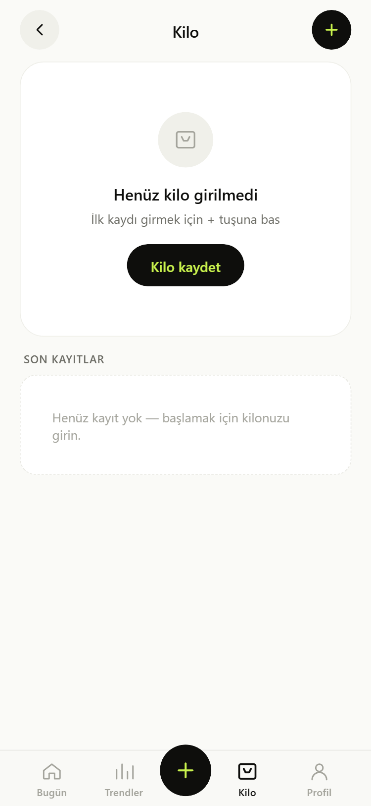
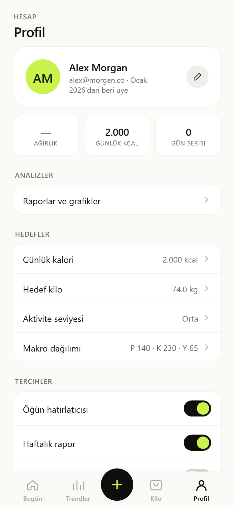

<div align="center">

# 🥗 Kaloria

**Akıllı Kalori & Beslenme Takip Uygulaması**

*React Native · Expo · TypeScript*

</div>

---

## 📱 Ekran Görüntüleri


<p align="center">
  
  
  
  
  
</p>

---

## ✨ Özellikler

| Kategori | Özellikler |
|----------|------------|
| 🍽️ **Beslenme** | Öğün takibi (Kahvaltı · Öğle · Akşam · Atıştırmalık), besin değerleri (P/K/Y) |
| 🔥 **Kalori** | Günlük hedef, makro dağılımı, öğün bazında analiz |
| 💧 **Su** | Günlük su takibi, görsel ilerleme |
| 🏋️ **Egzersiz** | Hızlı ekleme + özel egzersiz (isim, süre, kcal, ikon) |
| ⚖️ **Kilo** | Kilo günlüğü, grafik, hedef kilo takibi |
| 📊 **Raporlar** | Haftalık/aylık trend grafikleri |
| 🔔 **Bildirimler** | Öğün, su ve haftalık rapor hatırlatıcıları |
| 💾 **Veri** | JSON yedek alma/yükleme, CSV kilo dışa aktarma |
| 🌍 **Tam Türkçe** | Tüm arayüz ve bildirimler Türkçe |

---

## 🛠️ Teknoloji

- **Framework:** React Native + Expo SDK 51
- **Dil:** TypeScript
- **Navigasyon:** React Navigation v6
- **Depolama:** AsyncStorage
- **Grafikler:** react-native-svg
- **Bildirimler:** expo-notifications
- **Build:** EAS Build

---

## 🚀 Kurulum

```bash
# Bağımlılıkları yükle
npm install

# Expo Go ile çalıştır (telefon)
npx expo start

# Web önizlemesi
npx expo start --web
```

---

## 📦 APK Build

```bash
# Preview APK (test için)
eas build -p android --profile preview

# Production AAB (Play Store)
eas build -p android --profile production
```

---

## 📁 Proje Yapısı

```
src/
├── screens/        # Ekranlar (Dashboard, Meals, Profile…)
├── components/     # Tekrar kullanılan bileşenler
├── context/        # AppContext (global state)
├── data/           # Besin veritabanı
├── theme/          # Renkler ve stiller
├── types/          # TypeScript tipleri
└── utils/          # Bildirim & veri yardımcıları
```

---

<div align="center">

Made with ❤️ by [ks123098](https://github.com/ks123098)

</div>
